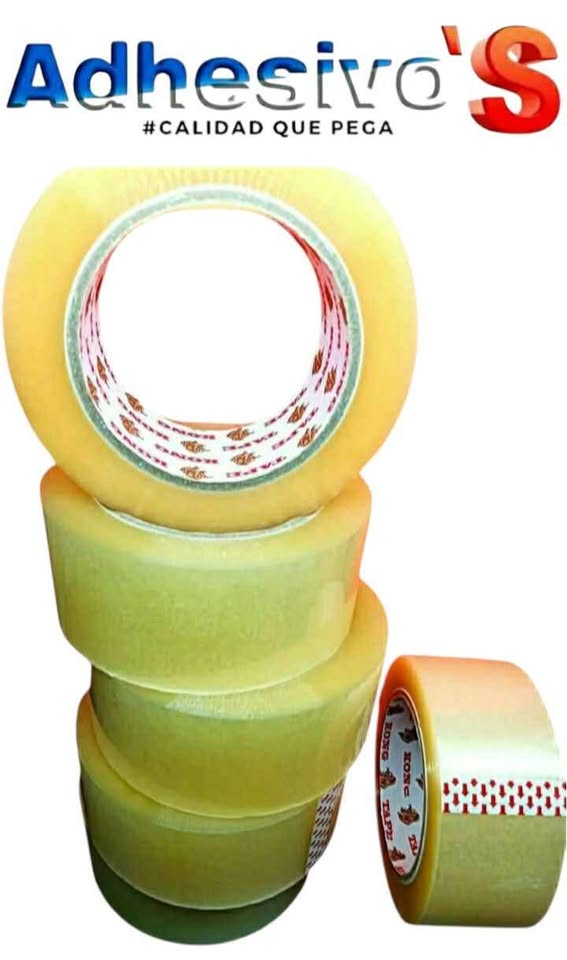

<!DOCTYPE html>
<html lang="es">
<head>
  <meta charset="UTF-8">
  <meta name="viewport" content="width=device-width, initial-scale=1.0">
  <title>Adhesivo'S</title>
  
</head>
<body>

<header>
  
  <h1></h1>
</header>

<section class="products">
  

    
    <h2>Cinta de empaque transparente Kong tape 48 mm X 150 m</h2>
    
Categoría: Uso convencional

  

  

    
    <h2>Cinta de empaque PVC Tape Bear 48 mm X 150 m</h2>
    
Categoría: Uso industrial

  

  

    
    <h2>Cinta kinesiológica 48 mm X 5 m</h2>
    
Categoría: Uso deportivo

  

  

    
    <h2>Cinta doble capa Nano tape 12 mm X 5 m</h2>
    
Categoría: Uso comercial

  

  

    
    <h2>Cinta Ducto gris Adhes tape Reforzada</h2>
    
Categoría: Uso industrial

  

</section>

<section class="contact-info">
  <h2>Contacto</h2>
  <a href="https://wa.me/5215619025655" target="_blank">WhatsApp</a>
  <a href="https://www.facebook.com/profile.php?id=100083484102582" target="_blank">Facebook</a>
  <a href="mailto:AdhesivoScorp@outlook.com">Correo Electrónico</a>
</section>

<footer>
  
&copy; 2025 Adhesivo'S. Todos los derechos reservados.

</footer>

</body>
</html>
